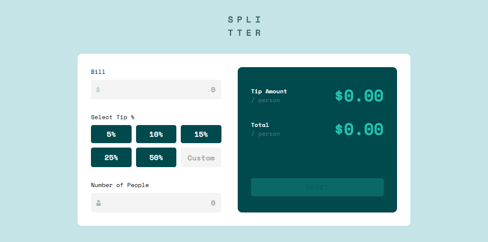

# Frontend Mentor - Tip calculator app solution

This is a solution to the [Tip calculator app challenge on Frontend Mentor](https://www.frontendmentor.io/challenges/tip-calculator-app-ugJNGbJUX). Frontend Mentor challenges help you improve your coding skills by building realistic projects.

## Table of contents

- [Overview](#overview)
  - [The challenge](#the-challenge)
  - [Screenshot](#screenshot)
  - [Links](#links)
- [My process](#my-process)
  - [Built with](#built-with)
  - [What I learned](#what-i-learned)
  - [Continued development](#continued-development)
- [Author](#author)

## Overview

### The challenge

Users should be able to:

- View the optimal layout for the app depending on their device's screen size
- See hover states for all interactive elements on the page
- Calculate the correct tip and total cost of the bill per person

### Screenshot

### Links

- Solution URL: [Add solution URL here](https://your-solution-url.com)
- Live Site URL: [Add live site URL here](https://your-live-site-url.com)

## My process

### Built with

- Semantic HTML5 markup
- Flexbox
- CSS Grid

### What I learned

This challenge has a very simple idea but the thing that gives me the hard time is the user experience (UX). Writing code to accomodate for UX has been very challenging and it took me 2 days to complete the JavaScript logic alone for the web app. I know for sure that there are many better ways I could have written this, but since I'm only practicing, I think I did a great job writing the logic and make sure that all edge cases are solved.

Another challenging thing is writing addEventListener in OOP paradigm in JavaScript. I recently learned OOP in JS and one thing that suddenly came to my mind is to redo this project with OOP paradigm and practice my OOP knowledge. The 'this' keyword has been tricky to work with specially with callback functions in OOP.

I learned a lot of tricks from doing this project. Whenever I faced a roadblock, most of the time what fixed it was to do a trick in JS, HTML and CSS. However, these tricks requires a chunk of fundamental knowledge which is why I always have the MDN web docs open on my browser. I also utilizes AI by asking questions, but thankfully I rarely do them specially when I needed it most.

Lastly, I've also learned previously from a course that it is better to write a flowchart and an architecture for the application before writing codes for it. I think this is one of the reason why I was able to do it in 3 days. I managed to structure the program's logic which gives me the clear view of what to do when writing the code.

### Continued development

I'm satisfied to the way I did this challenge. I think I've proven to myself that I can do OOP in JavaScript and that I know most if not all fundamental knowledge there is in JS.

I'm going to continue learning JavaScript and the next challenge I'm going to do is probably a hero section and a landing page. I wanted to do some good looking animations in a landing page and maybe soon I'll be able to create my own portfolio.

### Useful resources

- [MDN Web Docs](https://developer.mozilla.org/en-US/) - This helped me a lot as a reference point for JS, HTML & CSS components that I have forgotten how to write or things that might have been confusing to use.

## Author

- Frontend Mentor - [@SoftPillow20](https://www.frontendmentor.io/profile/SoftPillow20)
